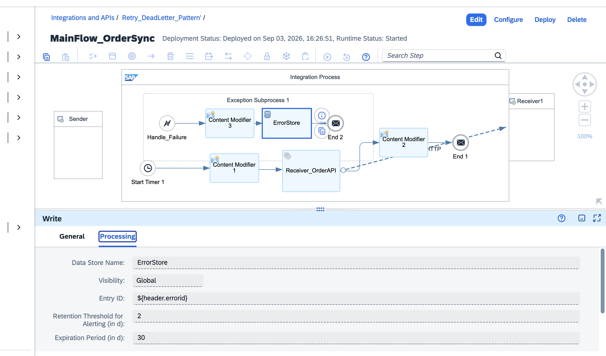
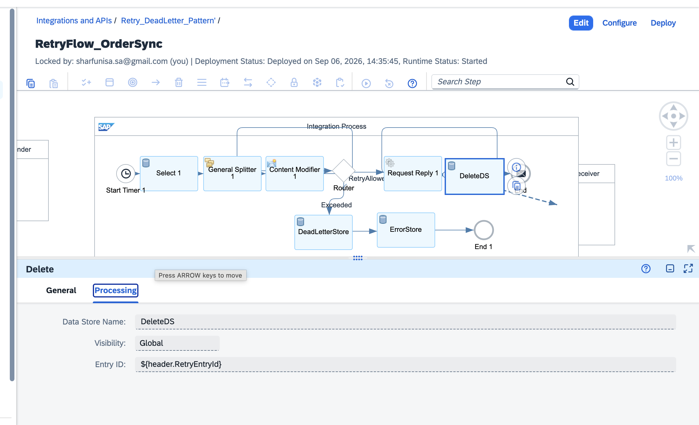
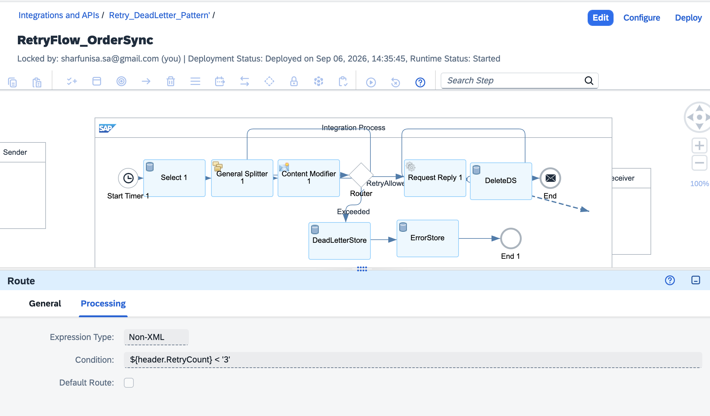
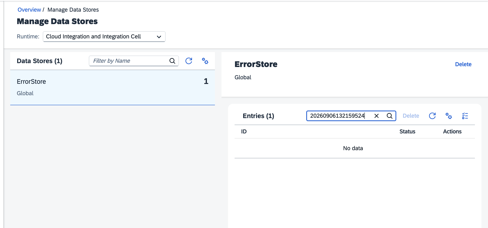
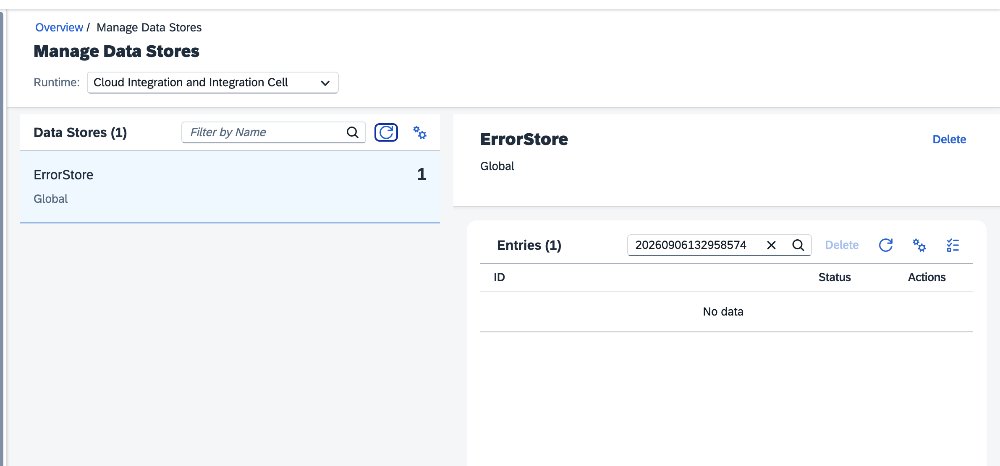

# SAP CPI Retry & Dead-Letter Pattern

A hands-on SAP Cloud Integration project exploring **exception handling, automatic retries, Data Store usage, and dead-letter processing** in SAP Integration Suite.

This project was built by deliberately introducing failures into an iFlow and then debugging them through the Message Processing Log and stack traces.

## Project Goal

The objective is to build a reusable integration pattern where:

```text
Main iFlow
   |
   | failure
   v
Exception Subprocess
   |
   v
Retry Flow
   |
   +---- retry succeeds ----> processing continues
   |
   +---- retry limit reached ----> Dead-Letter Store
```

**The full pattern is now working and verified end to end** — the retry loop, the retry-limit check, and the dead-letter routing for messages that fail permanently.

> This README documents the current working state, including the real bugs found and fixed to get there.

---

## Architecture

The project contains a main flow and a separate retry flow.

### Main Flow

```text
Timer / Trigger
      |
      v
Main Processing
      |
      v
Intentional Failure
      |
      v
Exception Subprocess
      |
      v
Store / Prepare Failed Message
```

### Retry Flow

```text
Retry Trigger
      |
      v
Read Failed Message
      |
      v
Check Retry Count
      |
      +---- Under limit ----> Resend
      |                          |
      |                    +---- Success ----> Delete from ErrorStore
      |                          |
      |                    +---- Failure ----> stays for next cycle
      |
      +---- Limit reached ----> Dead-Letter Store
```


---

## What I Practiced

* Exception Subprocess in SAP Cloud Integration
* Handling failures intentionally for testing
* Retry flow design, including a retry-count limit
* Dead-letter routing for permanently failed messages
* Data Store operations (Write, Select, Delete)
* Passing information between integration steps
* Message body vs. headers vs. exchange properties
* Debugging with the Message Processing Log
* Reading stack traces instead of relying only on the iFlow canvas
* XML wrapping for Data Store processing
* Verifying a fix with direct evidence instead of trusting a green status

---

## Key Learning: Debugging Matters

The most useful part of this exercise was not simply getting the retry flow to run.

I deliberately broke the integration several times and traced each failure back to its root cause — including bugs that produced **no error at all**, where everything looked successful but the actual behavior was wrong.

That changed the way I approach CPI debugging:

```text
Error (or suspicious "success")
  ↓
Read the exception, or check the actual stored data directly
  ↓
Identify the failing component
  ↓
Understand what CPI is actually doing
  ↓
Change one thing
  ↓
Redeploy / retest
  ↓
Verify with direct evidence, not just a green status
```

---

## Troubleshooting Findings

### 1. Exchange Properties and Exception Handling

One of the issues I encountered was that values stored as Exchange Properties before an exception did not behave as expected inside the Exception Subprocess.

Headers behaved differently.

This became an important reminder not to assume that every message attribute has the same lifecycle during exception handling.

---

### 2. Data Store Select and XML

The Data Store Select operation produced an XML parsing error when the stored content was JSON.

The important clue was the **Woodstox XML parser exception**.

Instead of treating the error as a generic CPI failure, I traced the exception back to the operation and discovered that the selected content was being processed as XML.

The solution was to work with an XML-wrapped representation for this part of the flow.


---

### 3. One Bad Data Store Entry Can Affect the Read

Another useful finding was that a malformed entry could cause the Data Store read/batch operation to fail rather than simply skipping the problematic entry.

That made validation and careful Data Store handling an important part of the design.

---

### 4. The Timer Only Ran Once

The main flow's Timer Start event was configured with `Repeat: None` and `Schedule: On Deployment` — meaning it fired exactly once, at deployment, and never again. This made the whole pattern look broken (nothing new ever appeared in the store) when the real issue was much simpler: it was never actually scheduled to repeat.

Fix: set `Repeat` to a real interval on both flows' timers.

---

### 5. A Data Store Split in Two, Silently

The same store name, `ErrorStore`, was written with two different **Visibility** settings (`Integration Flow` vs `Global`) at different points during the build. CPI does not merge these — it silently creates two completely separate stores that happen to share a name, which is confusing until you know to check for it. The retry flow's Select step could only ever see entries written with matching visibility.

Fix: standardize on `Global` visibility across every step that touches the store.

---

### 6. Constant vs. Expression — Twice

Two separate fields (the stack-trace header, and later the entry ID embedded in the stored XML) were set to **Constant** instead of **Expression**. With Constant, CPI stores the literal text — including the `${...}` syntax — instead of evaluating it. This produced no error at all; it just silently stored the wrong thing.



Fix: check the Source Type / Type dropdown on every field using `${...}` syntax — it must be `Expression`, not `Constant`.

---

### 7. A One-Letter Typo Broke the Delete

The Delete step's Data Store Name field read `ErrorSTore` instead of `ErrorStore`. Data store names are case-sensitive, so this silently targeted a store that didn't really hold the data — no error, just nothing deleted.

---

### 8. The Hardest One: Delete Step Pointed at Itself

Every retry run showed `COMPLETED`, and the resend call even returned a real `200 OK` — yet nothing was ever removed from `ErrorStore`. The actual cause: the Delete step's **Data Store Name** field held its own step name, `DeleteDS`, instead of the real target, `ErrorStore`. It was dutifully deleting from a store that didn't hold the real data, every single cycle, with no error thrown.



This was the hardest bug to catch because every visible signal — status, HTTP response — looked like success. Finding it required reading the step's actual configured field values directly, not trusting its label on the canvas or its run status.

---

## Main Flow

The main flow is configured to trigger processing and intentionally create a failure so that the exception-handling path can be tested.


The successful deployment and processing behaviour is documented through the project screenshots and debugging log.

---

## Retry Flow

The retry flow picks up failed messages, checks how many times each one has already been retried, resends it if under the limit, and routes it to a dedicated Dead-Letter store if it has failed too many times.


The retry-limit rule itself is a simple condition on the retry count:



---

## Verified Results

After completing the retry-limit and dead-letter routing, the full loop was verified across **two independent cycles** — not just a single run:





Each time, a real failure was deliberately triggered, captured with its real error message and stack trace, picked up automatically by the retry flow, resent successfully, and confirmed deleted via a direct search against the store returning "No data" — not just a green status.

---

## Current Status

| Area                              | Status               |
| --------------------------------- | --------------------- |
| Main iFlow                        | ✅ Working            |
| Intentional failure               | ✅ Tested             |
| Exception Subprocess              | ✅ Tested             |
| Retry flow                        | ✅ Working            |
| Data Store usage                  | ✅ Tested             |
| XML-wrapped Data Store content    | ✅ Tested             |
| Retry limit                       | ✅ Tested             |
| Dead-letter routing               | ✅ Tested             |
| Verified end to end (2 cycles)    | ✅ Confirmed          |
| Production SAP backend connection | ⏳ Future enhancement |

---

## Screenshots

The repository keeps the working screenshots under:

```text
docs/
└── screenshots/
    ├── 01-architecture-plan.png
    ├── 02-mainflow-timer-setup.png
    ├── 03-mainflow-deployed-success.png
    ├── 04-errorstore-entries-waiting.png
    ├── 05-content-modifier-payload.png
    ├── 06-xml-wrapped-fix.png
    ├── 07-retryflow-full-structure.png
    ├── 08-retryflow-completed-log.png
    ├── 09-mainflow-completed-log.png
    ├── 10-deletestep-wrong-datastore-name.png
    ├── 11-router-retrycount-condition.png
    ├── 12-proof-deleted-cycle1.png
    └── 13-proof-deleted-cycle2.png
```

Additional debugging notes are maintained in [`docs/debugging-log.md`](docs/debugging-log.md).

---

## Why This Project Matters

For an SAP ABAP / techno-functional developer, this project is an opportunity to move beyond writing backend code and practice **integration engineering on SAP BTP**.

The focus is not just on building an iFlow, but on understanding what happens when the integration fails:

* Where did the failure occur?
* What information survived the exception?
* What does the stack trace actually tell me?
* How should failed messages be retried?
* When should a message stop being retried?
* Where should permanently failed messages go?
* How do I know a fix actually worked, rather than just assuming it did?

These are the questions I used to make the project closer to a real integration scenario.

---

## Tech Stack

* SAP Integration Suite — Cloud Integration
* SAP BTP
* SAP Cloud Integration Exception Subprocess
* Data Store (Write, Select, Delete)
* Router (conditional retry-limit logic)
* Content Modifier
* Timer / Trigger
* XML
* Message Processing Log
* Stack-trace based debugging

---

## Next Step

The retry-and-dead-letter pattern is complete. The next milestone is to extend this into a more realistic SAP landscape — a **cloud-to-on-premise SAP integration** scenario, using the same reliability pattern built here.

---

## Author

**Sharfunisa Shajahan**

SAP ABAP / Techno-Functional Developer
