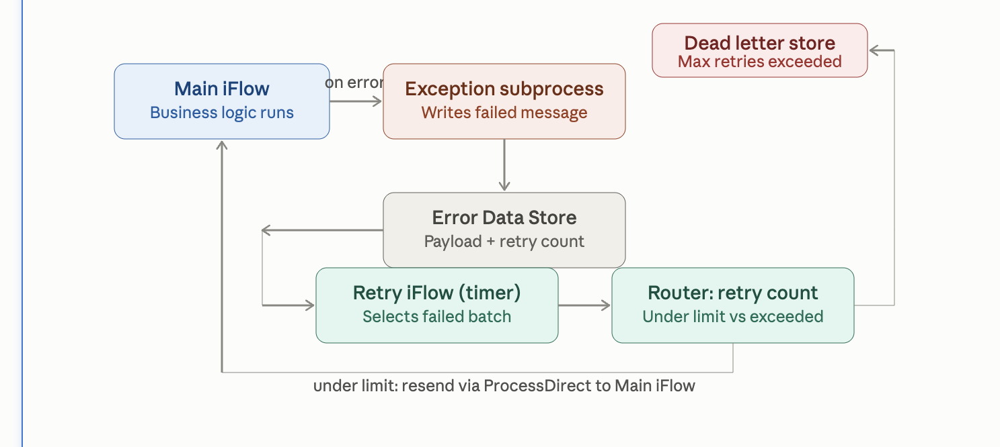
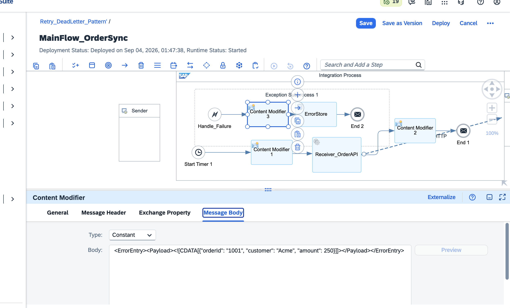
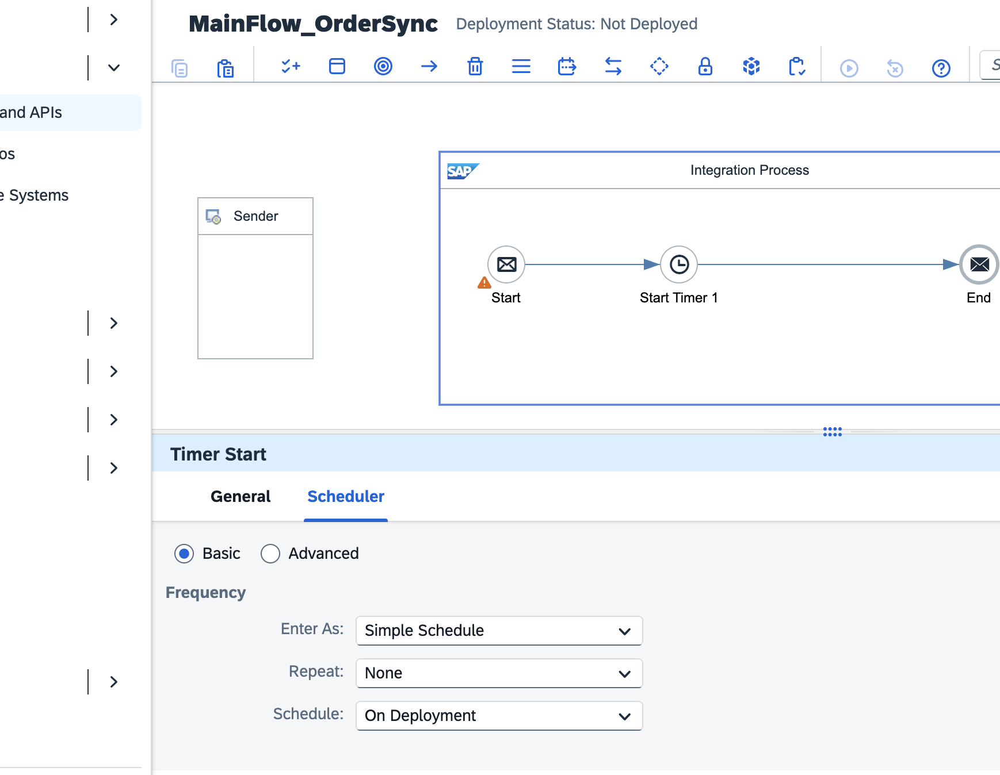
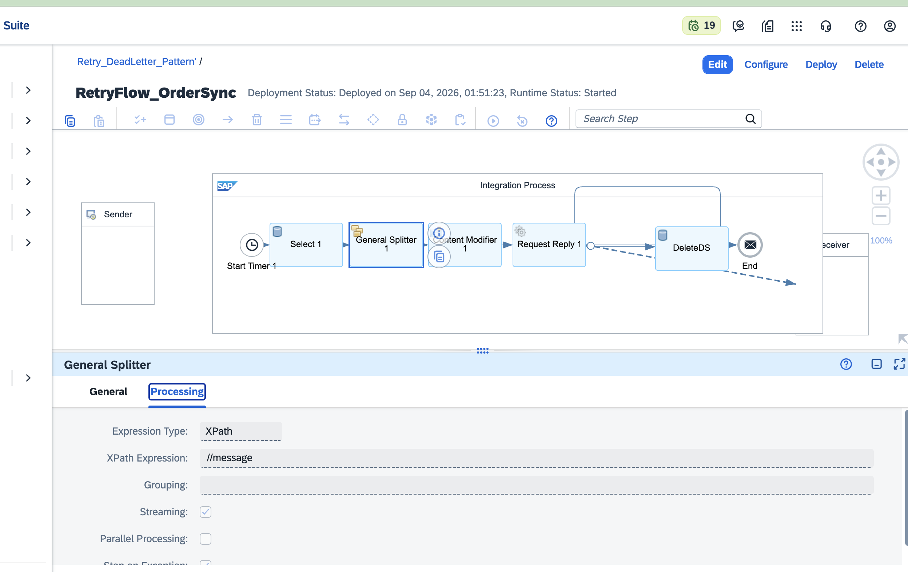

# SAP CPI Retry & Dead-Letter Pattern

A hands-on SAP Cloud Integration project exploring **exception handling, automatic retries, Data Store usage, and dead-letter processing** in SAP Integration Suite.

This project was built by deliberately introducing failures into an iFlow and then debugging them through the Message Processing Log and stack traces.

## Project Goal

The objective is to build a reusable integration pattern where:

```text
Main iFlow
   |
   | failure
   v
Exception Subprocess
   |
   v
Retry Flow
   |
   +---- retry succeeds ----> processing continues
   |
   +---- retry limit reached ----> Dead-Letter Store
```

The **retry loop is working**. The dead-letter portion — limiting retries and routing permanently failed messages to a separate store — is still being completed.

> This README intentionally documents the current working state rather than presenting the project as more complete than it is.

---

## Architecture

The project currently contains a main flow and a separate retry flow.

### Main Flow

```text
Timer / Trigger
      |
      v
Main Processing
      |
      v
Intentional Failure
      |
      v
Exception Subprocess
      |
      v
Store / Prepare Failed Message
```

### Retry Flow

```text
Retry Trigger
      |
      v
Read Failed Message
      |
      v
Retry Processing
      |
      +---- Success
      |
      +---- Failure
              |
              v
        Retry Again / Dead-Letter
```



---

## What I Practiced

* Exception Subprocess in SAP Cloud Integration
* Handling failures intentionally for testing
* Retry flow design
* Data Store operations
* Passing information between integration steps
* Message body vs. headers vs. exchange properties
* Debugging with the Message Processing Log
* Reading stack traces instead of relying only on the iFlow canvas
* XML wrapping for Data Store processing
* Building toward a dead-letter pattern

---

## Key Learning: Debugging Matters

The most useful part of this exercise was not simply getting the retry flow to run.

I deliberately broke the integration several times and traced each failure back to its root cause.

Some issues were not obvious from the iFlow canvas. The useful clues came from the **raw Message Processing Log and exception stack trace**.

That changed the way I approach CPI debugging:

```text
Error
  ↓
Read the exception
  ↓
Identify the failing component
  ↓
Understand what CPI is actually doing
  ↓
Change one thing
  ↓
Redeploy / retest
```

---

## Troubleshooting Findings

### 1. Exchange Properties and Exception Handling

One of the issues I encountered was that values stored as Exchange Properties before an exception did not behave as expected inside the Exception Subprocess.

Headers behaved differently.

This became an important reminder not to assume that every message attribute has the same lifecycle during exception handling.

---

### 2. Data Store Select and XML

The Data Store Select operation produced an XML parsing error when the stored content was JSON.

The important clue was the **Woodstox XML parser exception**.

Instead of treating the error as a generic CPI failure, I traced the exception back to the operation and discovered that the selected content was being processed as XML.

The solution was to work with an XML-wrapped representation for this part of the flow.



---

### 3. One Bad Data Store Entry Can Affect the Read

Another useful finding was that a malformed entry could cause the Data Store read/batch operation to fail rather than simply skipping the problematic entry.

That made validation and careful Data Store handling an important part of the design.

---

## Main Flow

The main flow is configured to trigger processing and intentionally create a failure so that the exception-handling path can be tested.



The successful deployment and processing behaviour is documented through the project screenshots and debugging log.

---

## Retry Flow

The retry flow is the core of this exercise.

Its responsibility is to pick up the failed message and attempt processing again.



The retry flow has been tested successfully. The next step is to introduce a retry counter/limit and move messages that continue to fail into a dedicated dead-letter store.

---

## Current Status

| Area                              | Status               |
| --------------------------------- | -------------------- |
| Main iFlow                        | ✅ Working            |
| Intentional failure               | ✅ Tested             |
| Exception Subprocess              | ✅ Tested             |
| Retry flow                        | ✅ Working            |
| Data Store usage                  | ✅ Tested             |
| XML-wrapped Data Store content    | ✅ Tested             |
| Retry limit                       | 🚧 In progress       |
| Dead-letter routing               | 🚧 In progress       |
| Production SAP backend connection | ⏳ Future enhancement |

---

## Screenshots

The repository keeps the working screenshots under:

```text
docs/
└── screenshots/
    ├── 01-architecture-plan.png
    ├── 02-mainflow-timer-setup.png
    ├── 03-mainflow-deployed-success...
    ├── 04-errorstore-entries-waiting...
    ├── 05-content-modifier-payload...
    ├── 06-xml-wrapped-fix.png
    ├── 07-retryflow-full-structure.png
    ├── 08-retryflow-completed-log...
    └── 09-mainflow-completed-log...
```

Additional debugging notes are maintained in [`docs/debugging-log.md`](docs/debugging-log.md).

---

## Why This Project Matters

For an SAP ABAP / techno-functional developer, this project is an opportunity to move beyond writing backend code and practice **integration engineering on SAP BTP**.

The focus is not just on building an iFlow, but on understanding what happens when the integration fails:

* Where did the failure occur?
* What information survived the exception?
* What does the stack trace actually tell me?
* How should failed messages be retried?
* When should a message stop being retried?
* Where should permanently failed messages go?

These are the questions I am using to make the project closer to a real integration scenario.

---

## Tech Stack

* SAP Integration Suite — Cloud Integration
* SAP BTP
* SAP Cloud Integration Exception Subprocess
* Data Store
* Content Modifier
* Timer / Trigger
* XML
* Message Processing Log
* Stack-trace based debugging

---

## Next Step

The next milestone is to complete the **dead-letter handling**:

```text
Failure
   ↓
Retry 1
   ↓
Retry 2
   ↓
Retry N
   ↓
Retry limit reached
   ↓
Dead-Letter Store
```

After that, I plan to extend the portfolio scenario toward a **cloud-to-on-premise SAP integration**, using the integration pattern in a more realistic SAP landscape.

---

## Author

**Sharfunisa Shajahan**

SAP ABAP / Techno-Functional Developer
